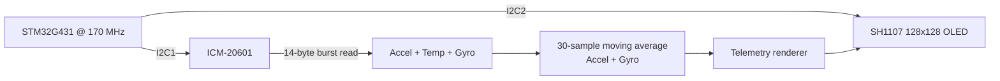

# STM32G4 ICM-20601 I2C Monitor

Dual-I²C IMU monitoring with 14-byte burst acquisition, moving-average filtering, and SH1107 OLED visualization.

> **Portfolio context:** This is a public-facing, sanitized portfolio edition of an educational prototype developed during an engineering internship/training period. It is not an official product or software release of the host company. See [NOTICE.md](NOTICE.md) before publication.

## Project overview

This repository demonstrates practical STM32 peripheral integration at register/driver level while keeping the full STM32CubeIDE project reproducible. The emphasis is on the engineering decisions visible in the firmware: peripheral configuration, acquisition timing, data handling, and hardware/software integration.

## Key features

- ICM-20601 register access over **I2C1**
- Separate **I2C2** bus dedicated to the SH1107 OLED
- **14-byte burst read** from `ACCEL_XOUT_H` through the gyroscope output registers
- 30-sample moving-average filter applied to accelerometer and gyroscope axes
- Temperature conversion and real-time display rendering
- On-board status LED heartbeat
- STM32CubeMX/STM32CubeIDE project configuration included

## System architecture



## Hardware & peripheral configuration

| Function | STM32 resource | Configuration |
|---|---|---|
| ICM-20601 | I2C1 / PB8-PB9 | standard-mode configuration |
| SH1107 OLED | I2C2 / PA9-PA8 | separate display bus |
| Status LED | PA5 | GPIO output |
| Core clock | STM32G431 | 170 MHz |

## Engineering details

The IMU driver starts at register `0x3B` (`ACCEL_XOUT_H`) and reads **14 contiguous bytes**, covering 3-axis acceleration, temperature and 3-axis angular-rate data. This reduces transaction overhead compared with seven independent two-byte reads.

The application keeps circular sample buffers for the six motion axes and computes a **30-sample moving average** before rendering the values. Temperature is converted separately with `(TEMP_OUT / 326.8) + 25` and is not averaged in this prototype.

## Repository structure

```text
Core/                    Application and user drivers
Drivers/                 STM32 HAL + CMSIS vendor dependencies
.settings/               STM32CubeIDE project settings
STM32G4_ICM20601_I2C_Monitor.ioc          STM32CubeMX configuration
docs/                    Technical report, media checklist and validation notes
README.md                Project landing page
NOTICE.md                Publication / ownership notice
.gitignore               Build and IDE exclusions
```

## Build & flash

1. Install **STM32CubeIDE** with STM32G4 device support.
2. Clone/download the repository.
3. In STM32CubeIDE, use **File → Import → Existing Projects into Workspace** and select the repository root.
4. Open `STM32G4_ICM20601_I2C_Monitor.ioc` to review the CubeMX peripheral configuration.
5. Build the project and flash the target through ST-LINK.

> The packaged source is based on the working internship prototype, but this portfolio bundle was not hardware-revalidated inside this ChatGPT environment. Perform a clean build and bench test before publishing a release tag.

## Validation evidence to add

Hardware photo; I²C logic-analyzer capture of the 14-byte burst; raw-vs-filtered plot if available; OLED telemetry screen.

See [`docs/media/README.md`](docs/media/README.md) for the publication-safe media checklist.

## Known limitations / next engineering steps

- The moving-average implementation is intentionally simple and recomputes the full window each update; a running-sum implementation would reduce CPU work.
- Startup samples are initially influenced by zero-initialized history until the window fills.
- The initialization check in the internship prototype is minimal; production code should validate the exact `WHO_AM_I` value (`0xAC`) and propagate HAL errors.
- No calibration, bias estimation, or sensor-fusion algorithm is implemented.

## Documentation

- [Technical report](docs/technical-report.md)
- [Validation checklist](docs/validation-checklist.md)
- [Recommended GitHub settings](REPOSITORY_SETTINGS.md)

## Reference

- TDK InvenSense ICM-20601 Datasheet (used for IMU register/scaling reference where applicable): https://product.tdk.com/system/files/dam/doc/product/sensor/mortion-inertial/imu/data_sheet/ds-000191-icm-20601-typ-v1.3.pdf
- STM32 HAL/CMSIS vendor licenses remain in their original `Drivers/` locations.

## Publication status

**GitHub pin recommendation:** YES — primary portfolio project.

No project-level open-source license is included until public-release ownership is confirmed.
