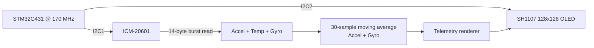

# Technical Report — STM32G4 ICM-20601 I2C Monitor

## 1. Problem statement

Acquire and smooth raw ICM-20601 motion data over I²C while maintaining an independent display channel.

## 2. Design requirements

- Read all motion channels with low transaction overhead.
- Separate sensor and display communication paths.
- Reduce visible high-frequency noise using a simple digital filter.
- Render six motion axes and temperature on a 128×128 display.

## 3. Architecture

## 4. Implementation strategy

- The sensor uses I2C1 while the OLED uses I2C2, reducing bus sharing and simplifying debugging.
- A contiguous 14-byte register read captures all required raw outputs in one transaction.
- A 30-sample moving average prioritizes display stability over fast transient response.

## 5. Firmware organization

The repository intentionally keeps STM32Cube-generated startup/HAL integration files together with the user application and peripheral drivers. This makes the project directly importable in STM32CubeIDE while the README and this report explain which parts contain the engineering logic.

The highest-value review points are:

- `Core/Src/main.c` — application flow and peripheral startup
- `Core/Src/icm20601.c` / `Core/Inc/icm20601.h` — IMU interface where present
- `Core/Src/SH1107.c` / `Core/Inc/SH1107.h` — framebuffer/display functions
- `STM32G4_ICM20601_I2C_Monitor.ioc` — clock tree, pin mux and peripheral configuration

## 6. Verification plan

- [ ] Verify exact `WHO_AM_I` = 0xAC in a hardened version.
- [ ] Capture I²C address + 14-byte read transaction with a logic analyzer.
- [ ] Log raw and filtered values to quantify smoothing and latency.
- [ ] Check each axis sign/orientation.
- [ ] Measure display refresh rate and ensure no bus errors under continuous operation.

## 7. Engineering review notes

This project is best presented as a **prototype that demonstrates peripheral-level embedded development**, not as production firmware. A production revision would add systematic HAL error handling, explicit configuration validation, unit/integration tests, fault recovery, parameterization and hardware-in-the-loop validation evidence.

## 8. Portfolio evidence standard

A professional release should contain at least one clear hardware photograph, one configuration/architecture visual, and one measurement artifact (oscilloscope, logic analyzer, serial log, or raw-vs-processed data) that proves the claimed behavior.
