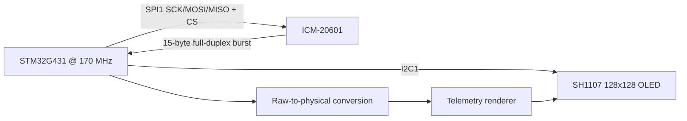

# STM32G4 ICM-20601 SPI Telemetry

Register-level SPI communication with an ICM-20601 IMU, burst acquisition, physical-unit conversion, and OLED telemetry.

> **Portfolio context:** This is a public-facing, sanitized portfolio edition of an educational prototype developed during an engineering internship/training period. It is not an official product or software release of the host company. See [NOTICE.md](NOTICE.md) before publication.

## Project overview

This repository demonstrates practical STM32 peripheral integration at register/driver level while keeping the full STM32CubeIDE project reproducible. The emphasis is on the engineering decisions visible in the firmware: peripheral configuration, acquisition timing, data handling, and hardware/software integration.

## Key features

- ICM-20601 communication over **SPI1** in master/full-duplex mode
- Software-controlled chip select on **PA4**
- `WHO_AM_I` communication check during initialization
- I²C slave interface disabled in the IMU for SPI-only operation
- **15-byte full-duplex transaction**: one register address byte + 14 sensor-data bytes
- Accelerometer, gyroscope and temperature conversion into physical units
- SH1107 OLED telemetry over a separate **I²C1** display link
- STM32CubeMX/STM32CubeIDE project configuration included

## System architecture



## Hardware & peripheral configuration

| Function | STM32 resource | Configuration |
|---|---|---|
| IMU SCK | SPI1 / PA5 | master |
| IMU MISO | SPI1 / PA6 | full duplex |
| IMU MOSI | SPI1 / PA7 | full duplex |
| IMU CS | GPIO / PA4 | software controlled |
| OLED | I2C1 / PB8-PB9 | 7-bit I²C |
| SPI baud | SPI1 | 170 MHz / 64 = 2.65625 Mbit/s |
| Core clock | STM32G431 | 170 MHz |

## Engineering details

A single SPI transaction begins at `ACCEL_XOUT_H` and clocks **14 consecutive data bytes** for accelerometer XYZ, temperature, and gyroscope XYZ. The portfolio source uses a synchronous `HAL_SPI_TransmitReceive()` transfer so the command/dummy clocks and received bytes remain aligned.

The physical-unit conversion in the prototype corresponds to the reset full-scale settings used by the device: `8192 LSB/g` for accelerometer data and `65.5 LSB/(°/s)` for gyroscope data. Temperature uses `(TEMP_OUT / 326.8) + 25`.

## Repository structure

```text
Core/                    Application and user drivers
Drivers/                 STM32 HAL + CMSIS vendor dependencies
.settings/               STM32CubeIDE project settings
STM32G4_ICM20601_SPI_Telemetry.ioc          STM32CubeMX configuration
docs/                    Technical report, media checklist and validation notes
README.md                Project landing page
NOTICE.md                Publication / ownership notice
.gitignore               Build and IDE exclusions
```

## Build & flash

1. Install **STM32CubeIDE** with STM32G4 device support.
2. Clone/download the repository.
3. In STM32CubeIDE, use **File → Import → Existing Projects into Workspace** and select the repository root.
4. Open `STM32G4_ICM20601_SPI_Telemetry.ioc` to review the CubeMX peripheral configuration.
5. Build the project and flash the target through ST-LINK.

> The packaged source is based on the working internship prototype, but this portfolio bundle was not hardware-revalidated inside this ChatGPT environment. Perform a clean build and bench test before publishing a release tag.

## Validation evidence to add

Hardware photo; SPI logic-analyzer capture showing CS + clock + burst transaction; OLED telemetry; CubeMX pinout.

See [`docs/media/README.md`](docs/media/README.md) for the publication-safe media checklist.

## Known limitations / next engineering steps

- Configuration currently relies on the sensor's reset full-scale settings rather than writing every measurement-range register explicitly. A production driver should set and verify all required configuration registers.
- Add timeout/error propagation around HAL transactions for production use.
- No calibration or bias compensation is implemented.
- Add logic-analyzer captures before tagging a validated public release.

## Documentation

- [Technical report](docs/technical-report.md)
- [Validation checklist](docs/validation-checklist.md)
- [Recommended GitHub settings](REPOSITORY_SETTINGS.md)

## Reference

- TDK InvenSense ICM-20601 Datasheet (used for IMU register/scaling reference where applicable): https://product.tdk.com/system/files/dam/doc/product/sensor/mortion-inertial/imu/data_sheet/ds-000191-icm-20601-typ-v1.3.pdf
- STM32 HAL/CMSIS vendor licenses remain in their original `Drivers/` locations.

## Publication status

**GitHub pin recommendation:** YES — primary portfolio project.

No project-level open-source license is included until public-release ownership is confirmed.
