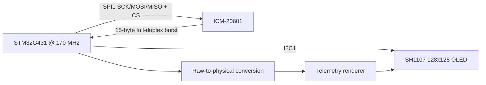

# Technical Report — STM32G4 ICM-20601 SPI Telemetry

## 1. Problem statement

Acquire multi-axis inertial data from an ICM-20601 over SPI and render human-readable telemetry on a separate OLED interface.

## 2. Design requirements

- Verify basic SPI communication during sensor initialization.
- Use full-duplex burst transfer for coherent multi-register data acquisition.
- Convert 16-bit signed sensor words into physical units.
- Keep the display link independent from the IMU SPI bus.

## 3. Architecture

## 4. Implementation strategy

- PA4 is used as software chip select, making transaction boundaries explicit.
- A single 15-byte `TransmitReceive` transaction keeps the command byte and returned burst aligned.
- OLED traffic remains on I2C1 so sensor and display buses do not contend.

## 5. Firmware organization

The repository intentionally keeps STM32Cube-generated startup/HAL integration files together with the user application and peripheral drivers. This makes the project directly importable in STM32CubeIDE while the README and this report explain which parts contain the engineering logic.

The highest-value review points are:

- `Core/Src/main.c` — application flow and peripheral startup
- `Core/Src/icm20601.c` / `Core/Inc/icm20601.h` — IMU interface where present
- `Core/Src/SH1107.c` / `Core/Inc/SH1107.h` — framebuffer/display functions
- `STM32G4_ICM20601_SPI_Telemetry.ioc` — clock tree, pin mux and peripheral configuration

## 6. Verification plan

- [ ] Read and record `WHO_AM_I` (expected 0xAC for ICM-20601).
- [ ] Capture SPI CS/SCK/MOSI/MISO with a logic analyzer.
- [ ] Check stationary acceleration magnitude/orientation behavior.
- [ ] Rotate each axis and verify gyro sign changes.
- [ ] Compare temperature output against ambient trend (not as a precision thermometer).

## 7. Engineering review notes

This project is best presented as a **prototype that demonstrates peripheral-level embedded development**, not as production firmware. A production revision would add systematic HAL error handling, explicit configuration validation, unit/integration tests, fault recovery, parameterization and hardware-in-the-loop validation evidence.

## 8. Portfolio evidence standard

A professional release should contain at least one clear hardware photograph, one configuration/architecture visual, and one measurement artifact (oscilloscope, logic analyzer, serial log, or raw-vs-processed data) that proves the claimed behavior.
