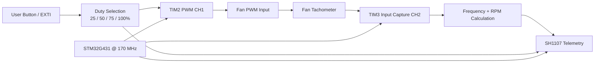

# STM32G4 PWM Fan Monitor

PWM fan control, tachometer-based RPM measurement, timer input capture, interrupts, and SH1107 OLED telemetry.

> **Portfolio context:** This is a public-facing, sanitized portfolio edition of an educational prototype developed during an engineering internship/training period. It is not an official product or software release of the host company. See [NOTICE.md](NOTICE.md) before publication.

## Project overview

This repository demonstrates practical STM32 peripheral integration at register/driver level while keeping the full STM32CubeIDE project reproducible. The emphasis is on the engineering decisions visible in the firmware: peripheral configuration, acquisition timing, data handling, and hardware/software integration.

## Key features

- Hardware PWM generation using **TIM2 Channel 1**
- Tachometer period measurement using **TIM3 Channel 2 input capture + interrupt**
- 1 MHz capture time base and timer-overflow handling
- RPM calculation with a configurable two-pulses-per-revolution assumption
- Button-driven duty-cycle state sequence: **25% → 50% → 75% → 100%**
- Real-time frequency, RPM, duty and run-state visualization on a **128×128 SH1107 OLED**
- STM32CubeMX/STM32CubeIDE project configuration included

## System architecture



## Hardware & peripheral configuration

| Function | STM32 resource | Configuration |
|---|---|---|
| Fan PWM | TIM2 CH1 / PA0 | PSC=2, ARR=959 |
| Tachometer | TIM3 CH2 / PA4 | falling-edge input capture, PSC=169 |
| OLED | I2C1 / PB8-PB9 | 7-bit I²C |
| User input | EXTI / PC13 | rising-edge interrupt |
| Core clock | STM32G431 | 170 MHz |

## Engineering details

With a 170 MHz timer clock and TIM3 prescaler of 169, the input-capture counter increments at **1 MHz**, so one count corresponds to 1 µs. The firmware measures the elapsed capture counts between two falling tachometer edges:

`f_tach = 1,000,000 / Δcount`

The current implementation assumes **2 tach pulses per revolution**:

`RPM = f_tach × 60 / 2`

For PWM, TIM2 uses `PSC=2` and `ARR=959`; compare values are changed directly to implement four discrete duty states.

## Repository structure

```text
Core/                    Application and user drivers
Drivers/                 STM32 HAL + CMSIS vendor dependencies
.settings/               STM32CubeIDE project settings
STM32G4_PWM_Fan_Monitor.ioc          STM32CubeMX configuration
docs/                    Technical report, media checklist and validation notes
README.md                Project landing page
NOTICE.md                Publication / ownership notice
.gitignore               Build and IDE exclusions
```

## Build & flash

1. Install **STM32CubeIDE** with STM32G4 device support.
2. Clone/download the repository.
3. In STM32CubeIDE, use **File → Import → Existing Projects into Workspace** and select the repository root.
4. Open `STM32G4_PWM_Fan_Monitor.ioc` to review the CubeMX peripheral configuration.
5. Build the project and flash the target through ST-LINK.

> The packaged source is based on the working internship prototype, but this portfolio bundle was not hardware-revalidated inside this ChatGPT environment. Perform a clean build and bench test before publishing a release tag.

## Validation evidence to add

Photo of the complete fan setup; PWM waveform at two duty levels; tachometer waveform; OLED telemetry screen.

See [`docs/media/README.md`](docs/media/README.md) for the publication-safe media checklist.

## Known limitations / next engineering steps

- The firmware **monitors** RPM but does not implement a feedback controller that automatically regulates RPM; it is therefore not described as closed-loop speed control.
- The RPM equation assumes two tach pulses per revolution. Change this constant for a different fan.
- Button debounce is not implemented in software.
- Add scope/logic-analyzer captures before tagging a validated public release.

## Documentation

- [Technical report](docs/technical-report.md)
- [Validation checklist](docs/validation-checklist.md)
- [Recommended GitHub settings](REPOSITORY_SETTINGS.md)

## Reference

- TDK InvenSense ICM-20601 Datasheet (used for IMU register/scaling reference where applicable): https://product.tdk.com/system/files/dam/doc/product/sensor/mortion-inertial/imu/data_sheet/ds-000191-icm-20601-typ-v1.3.pdf
- STM32 HAL/CMSIS vendor licenses remain in their original `Drivers/` locations.

## Publication status

**GitHub pin recommendation:** YES — primary portfolio project.

No project-level open-source license is included until public-release ownership is confirmed.
