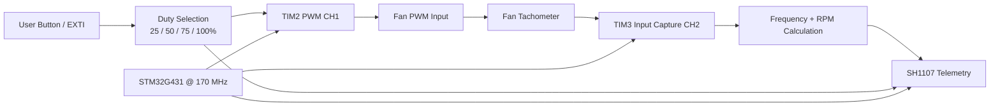

# Technical Report — STM32G4 PWM Fan Monitor

## 1. Problem statement

Provide deterministic fan actuation while measuring actual rotational speed and presenting the operating state locally.

## 2. Design requirements

- Generate hardware PWM without software bit-banging.
- Measure tachometer period using timer hardware and interrupts.
- Handle 16-bit timer wraparound during period measurement.
- Allow an operator to select discrete duty levels.
- Display duty, tach frequency, RPM and run state.

## 3. Architecture

## 4. Implementation strategy

- TIM2 is dedicated to PWM generation so duty updates require only a compare-register write.
- TIM3 input capture timestamps tachometer falling edges at 1 MHz, minimizing software timing jitter.
- The RPM calculation is separated from OLED rendering; display refresh runs at a slower 200 ms cadence.

## 5. Firmware organization

The repository intentionally keeps STM32Cube-generated startup/HAL integration files together with the user application and peripheral drivers. This makes the project directly importable in STM32CubeIDE while the README and this report explain which parts contain the engineering logic.

The highest-value review points are:

- `Core/Src/main.c` — application flow and peripheral startup
- `Core/Src/icm20601.c` / `Core/Inc/icm20601.h` — IMU interface where present
- `Core/Src/SH1107.c` / `Core/Inc/SH1107.h` — framebuffer/display functions
- `STM32G4_PWM_Fan_Monitor.ioc` — clock tree, pin mux and peripheral configuration

## 6. Verification plan

- [ ] Verify PWM frequency and duty on an oscilloscope.
- [ ] Verify tachometer pulse count per revolution for the exact fan.
- [ ] Compare displayed RPM with a trusted tachometer/reference.
- [ ] Test timer wraparound by observing low-speed/long-period behavior.
- [ ] Test button transitions and check for bounce-induced double steps.

## 7. Engineering review notes

This project is best presented as a **prototype that demonstrates peripheral-level embedded development**, not as production firmware. A production revision would add systematic HAL error handling, explicit configuration validation, unit/integration tests, fault recovery, parameterization and hardware-in-the-loop validation evidence.

## 8. Portfolio evidence standard

A professional release should contain at least one clear hardware photograph, one configuration/architecture visual, and one measurement artifact (oscilloscope, logic analyzer, serial log, or raw-vs-processed data) that proves the claimed behavior.
