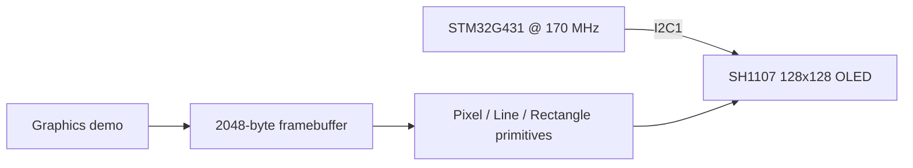

# STM32G4 SH1107 Display Driver

Framebuffer-based 128×128 SH1107 OLED driver with pixel, line, rectangle, and animation primitives over I²C.

> **Portfolio context:** This is a public-facing, sanitized portfolio edition of an educational prototype developed during an engineering internship/training period. It is not an official product or software release of the host company. See [NOTICE.md](NOTICE.md) before publication.

## Project overview

This repository demonstrates practical STM32 peripheral integration at register/driver level while keeping the full STM32CubeIDE project reproducible. The emphasis is on the engineering decisions visible in the firmware: peripheral configuration, acquisition timing, data handling, and hardware/software integration.

## Key features

- 128×128 monochrome framebuffer (**2048 bytes**)
- SH1107 command/data transport over STM32 HAL I²C
- Pixel primitive with clipping
- Bresenham-style line drawing
- Rectangle primitive built from line operations
- Page-wise framebuffer transfer to the display
- Simple line and expanding-rectangle animation tests
- STM32CubeMX/STM32CubeIDE project configuration included

## System architecture



## Hardware & peripheral configuration

| Function | STM32 resource | Configuration |
|---|---|---|
| SH1107 OLED | I2C1 / PB8-PB9 | 7-bit I²C |
| Status LED | PA5 | GPIO output |
| Framebuffer | MCU SRAM | 2048 bytes |
| Core clock | STM32G431 | 170 MHz |

## Engineering details

For a 128×128 monochrome display, one framebuffer requires `128 × 128 / 8 = 2048 bytes`. Pixel writes update this RAM buffer, while `SH1107_Update()` transfers the display one page at a time.

The line primitive uses an integer Bresenham-style error accumulator, allowing arbitrary line drawing without floating-point geometry.

## Repository structure

```text
Core/                    Application and user drivers
Drivers/                 STM32 HAL + CMSIS vendor dependencies
.settings/               STM32CubeIDE project settings
STM32G4_SH1107_Display_Driver.ioc          STM32CubeMX configuration
docs/                    Technical report, media checklist and validation notes
README.md                Project landing page
NOTICE.md                Publication / ownership notice
.gitignore               Build and IDE exclusions
```

## Build & flash

1. Install **STM32CubeIDE** with STM32G4 device support.
2. Clone/download the repository.
3. In STM32CubeIDE, use **File → Import → Existing Projects into Workspace** and select the repository root.
4. Open `STM32G4_SH1107_Display_Driver.ioc` to review the CubeMX peripheral configuration.
5. Build the project and flash the target through ST-LINK.

> The packaged source is based on the working internship prototype, but this portfolio bundle was not hardware-revalidated inside this ChatGPT environment. Perform a clean build and bench test before publishing a release tag.

## Validation evidence to add

Display close-up; line animation GIF; rectangle animation GIF; CubeMX I²C pinout.

See [`docs/media/README.md`](docs/media/README.md) for the publication-safe media checklist.

## Known limitations / next engineering steps

- The driver uses a global I²C handle; a reusable library would pass a device/context handle instead.
- Error status is not returned from display write functions.
- Font/text functionality is intentionally limited in this early standalone display demo.
- For a reusable library release, separate hardware transport, graphics primitives and application code.

## Documentation

- [Technical report](docs/technical-report.md)
- [Validation checklist](docs/validation-checklist.md)
- [Recommended GitHub settings](REPOSITORY_SETTINGS.md)

## Reference

- TDK InvenSense ICM-20601 Datasheet (used for IMU register/scaling reference where applicable): https://product.tdk.com/system/files/dam/doc/product/sensor/mortion-inertial/imu/data_sheet/ds-000191-icm-20601-typ-v1.3.pdf
- STM32 HAL/CMSIS vendor licenses remain in their original `Drivers/` locations.

## Publication status

**GitHub pin recommendation:** Optional — keep public but do not prioritize over the three main projects.

No project-level open-source license is included until public-release ownership is confirmed.
