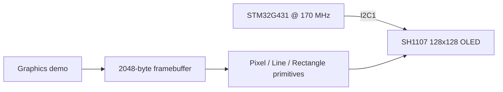

# Technical Report — STM32G4 SH1107 Display Driver

## 1. Problem statement

Drive a 128×128 SH1107 OLED from STM32 firmware without relying on a high-level graphics framework.

## 2. Design requirements

- Initialize the SH1107 over I²C.
- Maintain a full monochrome framebuffer in MCU RAM.
- Provide basic reusable drawing primitives.
- Transfer the framebuffer page-by-page.
- Demonstrate visible animation and geometry.

## 3. Architecture

## 4. Implementation strategy

- A 2048-byte framebuffer makes graphics operations independent of immediate I²C transfers.
- Line drawing uses integer arithmetic.
- Rectangles are composed from the line primitive rather than duplicating rasterization logic.

## 5. Firmware organization

The repository intentionally keeps STM32Cube-generated startup/HAL integration files together with the user application and peripheral drivers. This makes the project directly importable in STM32CubeIDE while the README and this report explain which parts contain the engineering logic.

The highest-value review points are:

- `Core/Src/main.c` — application flow and peripheral startup
- `Core/Src/icm20601.c` / `Core/Inc/icm20601.h` — IMU interface where present
- `Core/Src/SH1107.c` / `Core/Inc/SH1107.h` — framebuffer/display functions
- `STM32G4_SH1107_Display_Driver.ioc` — clock tree, pin mux and peripheral configuration

## 6. Verification plan

- [ ] Verify display initialization after power-up.
- [ ] Test pixels at all four corners for clipping/address offsets.
- [ ] Render horizontal, vertical and diagonal lines.
- [ ] Exercise full-screen page updates repeatedly.
- [ ] Capture I²C traffic if display addressing needs debugging.

## 7. Engineering review notes

This project is best presented as a **prototype that demonstrates peripheral-level embedded development**, not as production firmware. A production revision would add systematic HAL error handling, explicit configuration validation, unit/integration tests, fault recovery, parameterization and hardware-in-the-loop validation evidence.

## 8. Portfolio evidence standard

A professional release should contain at least one clear hardware photograph, one configuration/architecture visual, and one measurement artifact (oscilloscope, logic analyzer, serial log, or raw-vs-processed data) that proves the claimed behavior.
